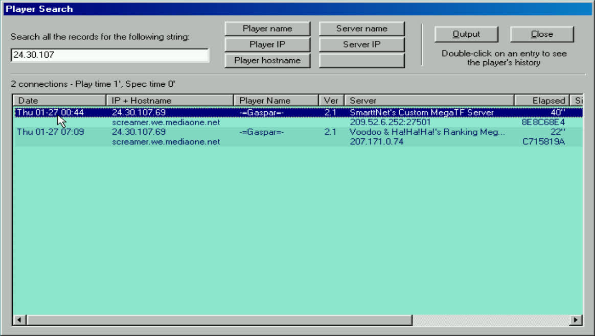
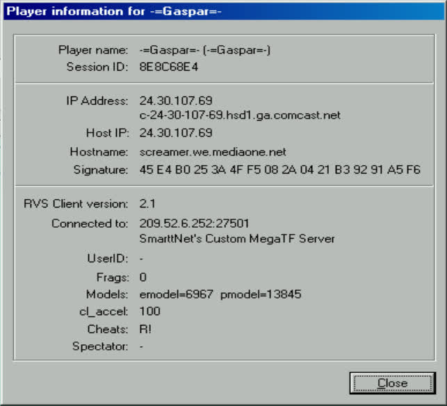

# rvspub

In the early 2000s, a cheat client was deliberately leaked for QuakeWorld. The
client phoned home, and data was collected for a year before the list of
cheaters was made public.

This is an attempt to reverse engineer the data format used to store the player
information.

The database contains `230 232` unique entries. The first entry was inserted
on `2000-01-26 at 23:44:02 +0000 UTC`, and the most recent entry is from
`2001-01-29 at 08:49:54 +0000 UTC.`

If you have any information, perhaps the cheat client or any other details
that might be useful, please reach out to me!

## Caveat

The presence of a name in this database does not definitively prove that the
individual behind that name was cheating. It only indicates that the leaked
cheat client was run by someone using that nickname at some point.

## Symbols

I don't have access to the cheat client and haven't been able to determine
with 100% certainty what the different symbols mean, but here's my best guess:

- `A!` - aimbot
- `B!` - wallhack
- `E!` - modified eyes model
- `F!` – fullbright
- `P?` - modified player model
- `R!` - radar
- `S!` - speed cheat

## Usage

```sh
$ make
$ ./rvspub -data-file reference/rvs.dat | head
version,external_ip_address,internal_ip_address,session_id,hostname,signature,timestamp,duration,server_address,server_hostname,user_id,name,eyes_model,player_model,frags,cl_accel,cheats,is_spectator
2.1,24.30.107.69,24.30.107.69,8e8c68e4,screamer.we.mediaone.net,45e4b0253a4ff5082a0421b39291a5f6,2000-01-26T23:44:02Z,2000-01-26T23:44:42Z,209.52.6.252:27501,SmarttNet's Custom MegaTF Server,0,-=Gaspar=-,6967,13845,0,100,R!,false
2.1,207.172.164.7,207.172.164.7,8f91b6f8,pavilion,45e4b0253a4ff5082a0421b39291a5f6,2000-01-27T00:09:04Z,2000-01-27T00:09:04Z,209.246.197.66:27500,[GOD].GameTrak.#2.CA,0,lasdf,6967,33168,0,100,P?,false
2.1,209.103.43.118,209.103.43.118,9e94a87b,anthony,45e4b0253a4ff5082a0421b39291a5f6,2000-01-27T00:00:34Z,2000-01-27T00:11:41Z,24.112.63.188:27500,Clan BEL MEGATF Public Server,0,Zeus,6967,13845,3,400,S! R!,false
2.1,207.172.164.7,207.172.164.7,8f91b6f8,pavilion,45e4b0253a4ff5082a0421b39291a5f6,2000-01-27T00:09:36Z,2000-01-27T00:12:43Z,209.246.197.66:27500,[GOD].GameTrak.#2.CA,0,lasdf,6967,33168,0,100,P? R!,false
2.1,216.209.204.4,216.209.204.4,9594330f,jon,45e4b0253a4ff5082a0421b39291a5f6,2000-01-27T00:19:05Z,2000-01-27T00:20:00Z,24.112.105.208:27500,BJServerOfLove,0,{e}Jon,6967,33168,0,100,P? R!,false
2.1,63.23.94.65,63.23.94.65,8b95d408,thomas-hwee,45e4b0253a4ff5082a0421b39291a5f6,2000-01-27T00:19:24Z,2000-01-27T00:20:19Z,208.195.192.5:27500,[I'm 12]'s Jungle Gym: QF or vanilla,0,newbie,6967,33168,0,9999,P? S! R!,false
2.1,203.109.137.46,203.109.137.46,969358ae,ihug.ihug.co.nz,45e4b0253a4ff5082a0421b39291a5f6,2000-01-27T00:37:45Z,2000-01-27T00:39:19Z,games.gen.nz,You Abuse and you lose,0,,6967,33168,0,100,P? R!,false
2.1,158.252.248.217,158.252.248.217,938a71bc,lyle,45e4b0253a4ff5082a0421b39291a5f6,2000-01-27T00:36:34Z,2000-01-27T00:41:15Z,localhost,Intel TF2.9 Clan[GT],0,Glint,0,0,-2,100,E! P?,false
2.1,63.26.145.242,63.26.145.242,9b964532,default,45e4b0253a4ff5082a0421b39291a5f6,2000-01-27T00:59:53Z,2000-01-27T01:17:03Z,static.com:27500,Static's Clan Arena Damage,0,practiceing name,10539,13845,5,120,E! S!,false
```

## Screenshots

The following are screenshots from the original `rvs13.exe`, which was published
together with the `dat` file back in 2001.





## Disclaimer

The original `.exe` file that was released alongside the database can be found
in the `resources` directory. I have not yet analyzed the binary, so run it at
your own risk!

The dataset that was published is also available in the `resources` directory.
This is the database I have been using as a reference while writing this tool.

## Protocol

The client I was able to get my hands on reports version `3.4`, we can see in
the database that there has been earlier versions as well. By analyzing both
the data sent over the network and the binary itself, I was able to determine
how it all ties together.

### Encryption

While analyzing the client and server binaries, I found that three different
encryption schemes were used. All of them relied on the same key, `Cproc%2u`,
which was embedded in both the client and the server.

The encryption was used to encode strings served by the master servers, as
well as to obscure data transferred from the client to the servers.

Based on the decrypted strings found in the client, it is likely that the
client extracted data from email and ICQ account information, along with the
registered name and organization of the operating system. This data was likely
used to construct a unique fingerprint associated with the client.

### Master

When the client starts, it attempts to establish HTTP connections to a set of
hardcoded IP addresses.

These IP addresses are, of course, stored in the binary but are encrypted
using the `v3` version of their crypto. Below is a table that displays the
addresses and their corresponding encrypted versions.

| Plaintext        | Ciphertext                     |
|------------------|--------------------------------|
| 206.253.222.119  | HBEAEEEBFBBAABFLHBECEAEBFCBEAL |
| 209.1.224.18     | HBEAELEBFCALAAEHHHFOEDFH       |
| 209.90.125.196   | HBEAELEBFKBFBMEEHBEFFMFOFKBD   |
| 216.234.161.84   | HBEBEEEBFBBGAGFLHCEGEDEBFLBB   |

Once a connection is established, the client attempts to retrieve resources
from the following paths:

- `/rvssystem/test.txt`
- `/rvssystem/msg.txt`

#### test.txt

This file essentially contains a list of servers that the client can choose
from to publish its data.

The addresses of the actual servers are encrypted using what I refer to as the
v3 version of the crypto.

The client ensures that the strings `200 OK` and `RVS SERVER LIST` are present
in the returned data before attempting to decrypt it.

Once decrypted, the client sends an `RVSS` command to each server in the list.
This command acts as a status message and returns information such as:

- The number of entries in the database
- The server's uptime
- The features enabled on that particular server

However, I believe the primary purpose of this was to measure the round-trip
time between the client and the servers, so the client could select the one
with the lowest latency for data reporting.

Example:

```sh
$ cat test.txt
RVS SERVER LIST
HCEJEAEBFCBDAKFLHBEAEDEBFBBFAKHP
```

#### msg.txt

This file served as a way for `RVS` to deliver messages to its users. When
formatted correctly, the message would be displayed in the client when it
connected to a server.

The message was rendered in the client like this:

```
**** QWRE UPDATE ****
The message
*********************
```

Surprisingly, the contents of `msg.txt` were not encrypted, but simply
formatted as follows:

```
$ cat msg.txt
MSGVER3 'the message'
```

The client checked for the presence of `200 OK` in the response and also verified
that the message was formatted correctly before displaying it.

### Reporting

When the client connects to a server, it starts reporting back to one of the
servers it received from the `test.txt` server list described in the previous
section.

Every 10 seconds, it transmits `448` bytes of data to the selected server. This
data is encrypted using the `v2` encryption.

The data contains, among other things:

- MAC address
- Computer name
- Operating system
- Registered name
- Registered organization
- Server connected to
- Player name
- Enabled cheats

It is worth noting that not all data was included in the dump published in
2001. For example, the MAC address, operating system, registered name, and
organization were not stored in the dump. However, they were used to
compute the MD5 signature. See the MD5 section for more details.

Below is a decrypted dump of the actual data transmitted by the client to the
server.

```
$ cat data | rvscrypto -d | xxd
00000000: 5256 484b f8ea 23ad 0000 0003 0000 0004  RVHK..#.........
00000010: 0000 0004 0000 0006 0000 0180 0000 0000  ................
00000020: c0a8 c9d0 0800 279e 9caa 0000 0000 c592  ......'.........
00000030: 0000 0a11 0000 105e 0000 0000 0000 0000  .......^........
00000040: fc13 5b68 3600 0000 6f73 6d2d 7465 7374  ..[h6...osm-test
00000050: 0000 0000 0000 0000 0000 0000 0000 0000  ................
00000060: 0000 0000 0000 0000 0000 0000 0000 0000  ................
00000070: 0000 0000 0000 0000 0000 0000 0000 0000  ................
00000080: 0000 0000 0000 0000 5769 6e39 7820 342e  ........Win9x 4.
00000090: 3130 2e32 3232 3200 0000 0000 0000 0000  10.2222.........
000000a0: 0000 0000 0000 0000 6f73 6d00 0000 0000  ........osm.....
000000b0: 0000 0000 0000 0000 0000 0000 0000 0000  ................
000000c0: 0000 0000 0000 0000 5175 616b 6557 6f72  ........QuakeWor
000000d0: 6c64 0000 0000 0000 0000 0000 0000 0000  ld..............
000000e0: 0000 0000 0000 0000 0000 0000 0000 0000  ................
000000f0: 0000 0000 0000 0000 0000 0000 0000 0000  ................
00000100: 0000 0000 0000 0000 0000 0000 6c6f 6361  ............loca
00000110: 6c68 6f73 7400 0000 0000 0000 0000 0000  lhost...........
00000120: 0000 0000 7465 7374 2d73 6572 7665 7200  ....test-server.
00000130: 0000 0000 0000 0000 0000 0000 0000 0000  ................
00000140: 0000 0000 0000 0000 0000 0000 0000 0000  ................
00000150: 0000 0000 0000 0000 0000 0000 0000 0000  ................
00000160: 0000 0000 0100 0000 7465 7374 2d70 6c61  ........test-pla
00000170: 7965 7200 0000 0000 0000 0000 0000 0000  yer.............
00000180: 0000 0000 0000 0000 0000 0000 0000 1b37  ...............7
00000190: 0000 8190 0000 0000 f401 0080 0100 0000  ................
000001a0: 0500 0000 0000 0000 0000 0000 0000 0000  ................
000001b0: 0000 0000 0000 0000 0000 0000 0000 0000  ................
```

The following table describes the offsets and usage for most of the data.

| Offset | Size  | Description                                 |
|--------|-------|---------------------------------------------|
| 0x00   | 0x4   | Header                                      |
| 0x04   | 0x4   | Session ID                                  |
| 0x08   | 0x4   | Version                                     |
| 0x0c   | 0x4   | Version                                     |
| 0x10   | 0x4   | Message format                              |
| 0x14   | 0x4   | Current frame in QuakeWorld                 |
| 0x18   | 0x4   | Magic bytes used for validation             |
| 0x1c   | 0x4   | Seems to be unused                          |
| 0x20   | 0x4   | Host IPv4 address                           |
| 0x24   | 0x6   | MAC address                                 |
| 0x2a   | 0x2   | Seems to be unused                          |
| 0x2c   | 0x4   | Unknown 32-bit number used by signature     |
| 0x30   | 0x4   | Unknown 32-bit number used by signature     |
| 0x34   | 0x4   | Unknown 32-bit number used by signature     |
| 0x38   | 0x4   | If set, overrides IPv4 address sent on wire |
| 0x3c   | 0x4   | Seems to be unused                          |
| 0x40   | 0x4   | Timestamp                                   |
| 0x44   | 0x4   | Elapsed time since the timestamp            |
| 0x48   | 0x20  | Computer name                               |
| 0x68   | 0x20  | Seems to be unused                          |
| 0x88   | 0x20  | Operating system                            |
| 0xa8   | 0x20  | Registered name                             |
| 0xc8   | 0x20  | Registered organization                     |
| 0xe8   | 0x24  | Seems to be unused                          |
| 0x10c  | 0x18  | Server address                              |
| 0x124  | 0x40  | Server hostname                             |
| 0x164  | 0x04  | User ID                                     |
| 0x168  | 0x20  | Player name                                 |
| 0x188  | 0x04  | Set if player is a spectator                |
| 0x18d  | 0x04  | Eyes model checksum                         |
| 0x192  | 0x04  | Player model checksum                       |
| 0x196  | 0x04  | Frags                                       |
| 0x198  | 0x04  | `cl_accel` value                            |
| 0x19d  | 0x04  | Set if `qwre` cheats are used               |
| 0x1a0  | 0x04  | Set if `gotwalls` cheats are used           |
| 0x1a4  | 0x1c  | Seems to be unused                          |

#### MD5

In version `3.4` of the client, the server software calculates an MD5
signature, likely to make it possible to identify players even if they are on
a different network, using different player names, and so on.

The MD5 signature is computed based on the client's MAC address, three 32-bit
integers (which are unknown to me), the registered name, and the organization.
This adds up to `82` bytes, with an additional 4 empty bytes used, bringing
the total size of the input to `86` bytes.

Example that computes the MD5 checksum based on the above data:

```go
package main

import (
	"crypto/md5"
	"encoding/binary"
	"fmt"
)

func main() {
	in := []byte{
		// MAC address
		0x08, 0x00, 0x27, 0x9e, 0x9c, 0xaa,

		// Unknown 32-bit fingerprint integers
		0x00, 0x00, 0xc5, 0x92,
		0x00, 0x00, 0x0a, 0x11,
		0x00, 0x00, 0x10, 0x5e,

		// Four empty bytes
		0x00, 0x00, 0x00, 0x00,

		// Registration name
		0x6f, 0x73, 0x6d, 0x00, 0x00, 0x00, 0x00, 0x00,
		0x00, 0x00, 0x00, 0x00, 0x00, 0x00, 0x00, 0x00,
		0x00, 0x00, 0x00, 0x00, 0x00, 0x00, 0x00, 0x00,
		0x00, 0x00, 0x00, 0x00, 0x00, 0x00, 0x00, 0x00,

		// Registration organization
		0x51, 0x75, 0x61, 0x6b, 0x65, 0x57, 0x6f, 0x72,
		0x6c, 0x64, 0x00, 0x00, 0x00, 0x00, 0x00, 0x00,
		0x00, 0x00, 0x00, 0x00, 0x00, 0x00, 0x00, 0x00,
		0x00, 0x00, 0x00, 0x00, 0x00, 0x00, 0x00, 0x00,
	}

	out := make([]byte, len(in))

	copy(out, in[0:6])

	binary.LittleEndian.PutUint32(out[6:], binary.BigEndian.Uint32(in[6:10]))
	binary.LittleEndian.PutUint32(out[10:], binary.BigEndian.Uint32(in[10:14]))
	binary.LittleEndian.PutUint32(out[14:], binary.BigEndian.Uint32(in[14:18]))

	copy(out[22:], in[22:54])
	copy(out[54:], in[54:])

	fmt.Printf("MD5: %x\n", md5.Sum(out))
}
```

## Credits

Special thanks to the following individuals for providing valuable data and
information:

- HangTime
- ParadokS
- splash
- To the author(s) of RVS, whoever you may be
- Novate
- RoT// Red Fox

## Final Note

CRIME DOSE NOT PAY [sic]
